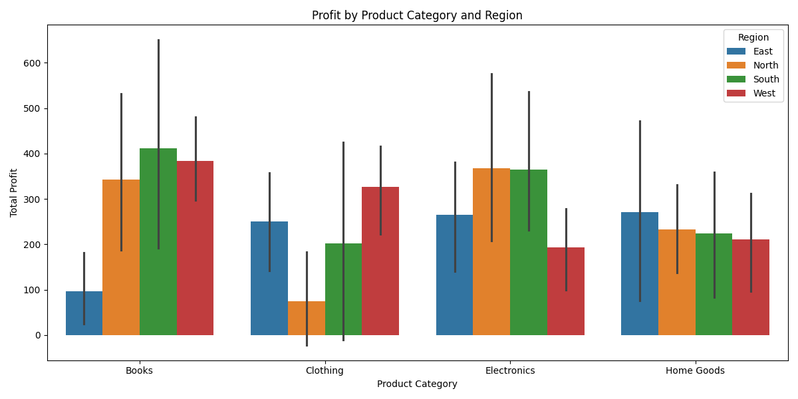
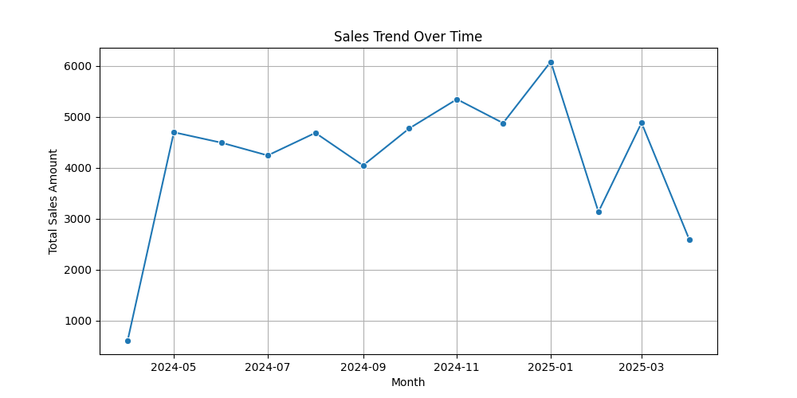
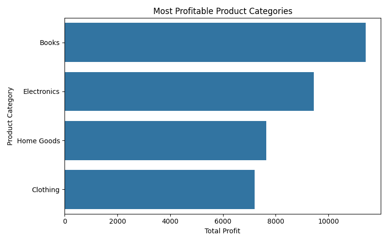
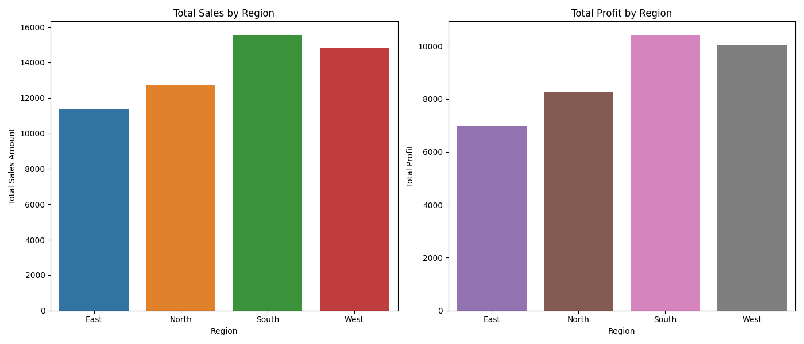

# custom-bi-sgollanw

## Project Setup Guide (1-Mac/Linux)

Run all commands from a terminal in the root project folder. 

### Step 1A - Create a Local Project Virtual Environment

```shell
python3 -m venv .venv
```

### Step 1B - Activate the Virtual Environment

```shell
source .venv/bin/activate
```

### Step 1C - Install Packages

```shell
python3 -m pip install --upgrade -r requirements.txt
```

### Step 1D - Optional: Verify .venv Setup

```shell
python3 -m datafun_venv_checker.venv_checker
```

### Step 1E - Run the initial project script

```shell
python3 scripts/data_prep.py
```

-----

## Project Setup Guide (2-Windows)

Run all commands from a PowerShell terminal in the root project folder.

### Step 2A - Create a Local Project Virtual Environment

```shell
py -m venv .venv
```

### Step 2B - Activate the Virtual Environment

```shell
.venv\Scripts\activate
```

### Step 2C - Install Packages

```shell
py -m pip install --upgrade -r requirements.txt
```

### Step 2D - Optional: Verify .venv Setup

```shell
py -m datafun_venv_checker.venv_checker
```

### Step 2E - Run the initial project script

```shell
py scripts/data_prep.py
```

-----

## Initial Package List (For Reference)

```
pip
setuptools
wheel
loguru
python-dotenv
pyttsx3
ipython
jupyter
ipykernel
ipywidgets
pandas
matplotlib
seaborn
```

## Commands Used (Frequently) to update GitHub 

```
# to check the status
git status
# to stage the files
git add .
# to commit with message
git commit -m "<<message to commit>>"
# to push into remote branch
git push -u origin main
```

-----

## Section 1. The Business Goal

The primary business goal of this project is to analyze sales data to generate actionable insights that help identify:
1. The most profitable product categories by region and month.
2. Sales trends over time.
3. Regional performance in terms of sales and profit.
4. The top-performing products by profitability.

These insights aim to support data-driven decision-making for improving profitability and operational efficiency.

-----

## Section 2. Data Source

The data used in this project is stored in `data/sales_data.csv`. It contains the following fields:
- `order_id`: Unique identifier for each order.
- `order_date`: Date of the order.
- `product_category`: Category of the product sold.
- `region`: Region where the sale occurred.
- `sales_amount`: Total sales amount for the order.
- `cost`: Cost incurred for the order.
- `payment_method`: Payment method used for the order.
- `profit`: Profit calculated as `sales_amount - cost`.

-----

## Section 3. Tools Used

The following tools and libraries were used in this project:
- **Python**: For data processing and analysis.
- **Pandas**: For data manipulation and aggregation.
- **Seaborn**: For creating visualizations.
- **Matplotlib**: For plotting graphs.
- **Git**: For version control.
- **Jupyter Notebook**: For exploratory data analysis.

-----

## Section 4. Workflow & Logic

1. **Data Preparation**:
   - The `data_prep.py` script generates synthetic sales data and saves it to `data/sales_data.csv`.

2. **Analysis Goals**:
   - **Goal 1**: Identify the most profitable product categories by region and month (`goal1_profit_analysis.py`).
   - **Goal 2**: Analyze sales trends over time (`goal2_sales_trend.py`).
   - **Goal 3**: Rank products by profitability (`goal3_product_profitability.py`).
   - **Goal 4**: Drill down into regional performance (`goal4_regional_performance.py`).

3. **Visualization**:
   - Bar plots and line plots were created to visualize the results.

4. **Output**:
   - Results and visualizations are saved in the `images` directory.

-----

## Section 5. Results (Narrative + Visualizations)

### Narrative:
1. **Most Profitable Product Categories**:
   - Electronics consistently outperformed other categories in terms of profit across all regions.

2. **Sales Trends**:
   - Sales peaked during the holiday season, with a noticeable dip in the summer months.

3. **Regional Performance**:
   - The North region generated the highest sales and profit, followed by the West region.

4. **Top Products**:
   - Electronics and Home Goods were the most profitable product categories.

### Visualizations:
- **Profit by Product Category and Region**:
  
  

- **Sales Trend Over Time**: 
  
  

- **Most Profitable Product Categories**: 
  
  

- **Regional Performance**: 
  
  
  

-----

## Section 6. Suggested Business Action

1. Focus marketing efforts on the **Electronics** and **Home Goods** categories to maximize profitability.
2. Increase inventory in the **North** and **West** regions to meet demand.
3. Launch targeted promotions during the summer months to boost sales during the off-peak season.
4. Optimize pricing strategies for underperforming categories like **Books**.

-----

## Section 7. Challenges

1. **Data Quality**:
   - Synthetic data was used, which may not fully reflect real-world scenarios.
   - Missing or incomplete data could impact the accuracy of insights.

2. **Visualization**:
   - Balancing simplicity and detail in visualizations was challenging.

3. **Scalability**:
   - The current implementation is designed for small datasets. Scaling to larger datasets may require optimization or distributed computing tools like Apache Spark.

-----

## Section 8. Ethical Considerations

1. **Bias in Data**:
   - Ensure that the data used for analysis is representative and does not reinforce existing biases.

2. **Privacy**:
   - Avoid using personally identifiable information (PII) in the analysis.

3. **Transparency**:
   - Clearly document the methodology and assumptions used in the analysis.

4. **Responsible Decision-Making**:
   - Use insights to support ethical and fair business practices, avoiding over-reliance on AI for decisions requiring human judgment.

-----